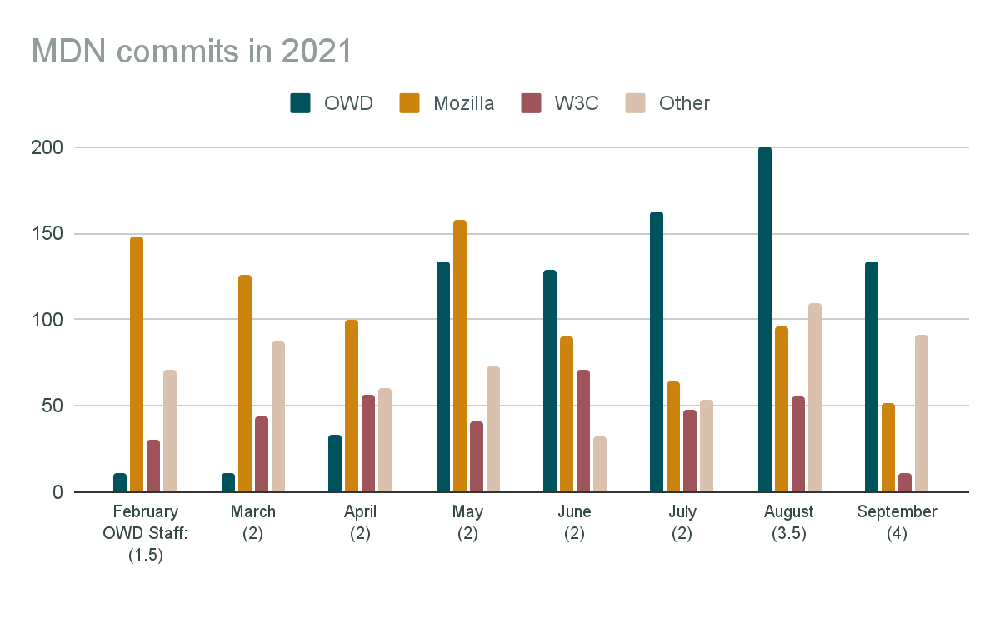
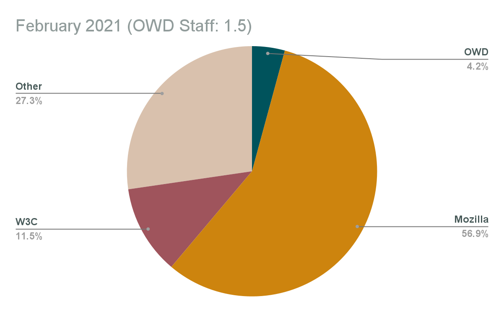
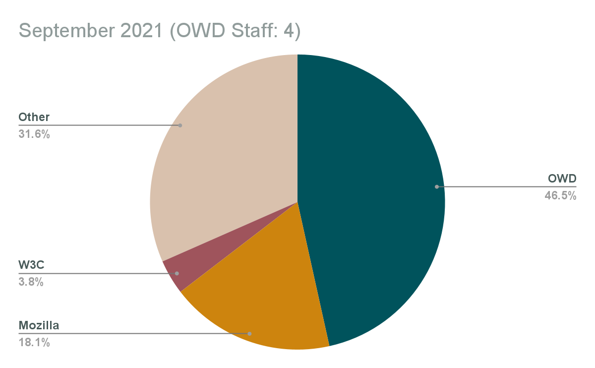
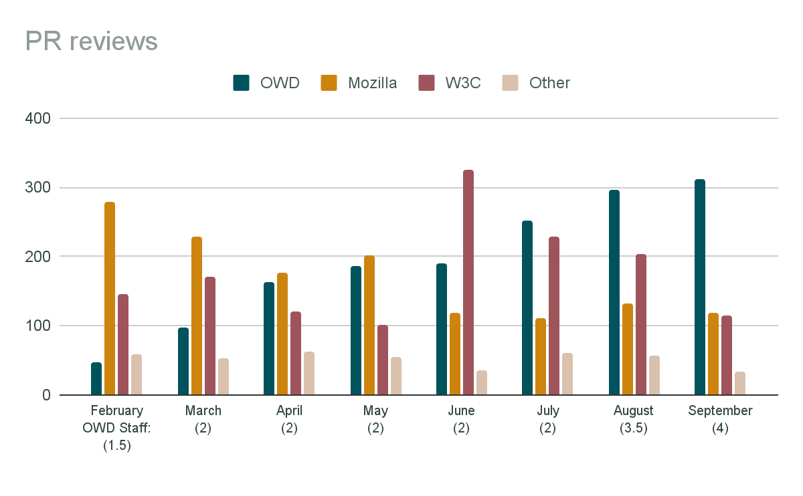
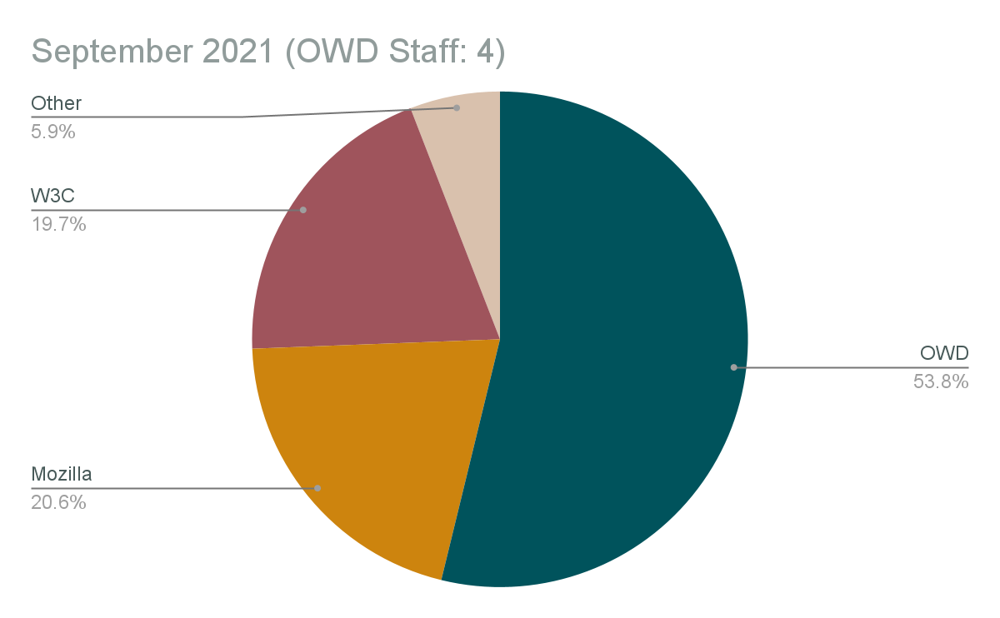

# Open Web Docs Impact and Transparency Report 2021

By Florian Scholz, Will Bamberg, Jean-Yves Perrier, Estelle Weyl, Jory Burson

October 2021

## Executive Summary

After 12 months of existence, Open Web Docs is a
collective of 9 organizations and employs 4 full-time Senior Technical
Writers who have extensive experience with Web standards documentation
and MDN Web Docs.

The collective received $790,000 in donations from
organizations and 130 people backed or donated to Open Web Docs
individually.

Open Web Docs’ main focus has been contributions to MDN
Web Docs, the premier platform for Web platform documentation. It is
estimated that it has about 18 million monthly users and therefore OWD
contributions reach the vast majority of web developers.

In September 2021, OWD staff were responsible for
nearly half of the commits and more than half of the reviews to the
mdn/content GitHub repository.

Open Web Docs, working with a growing set of organizations getting
involved in supporting MDN Web Docs, has established a quarterly
prioritization process to work on key infrastructure and content work.
Projects in 2021 included: Migrating MDN content to Markdown,
Collaborating with the W3C to integrate specification data into browser
compatibility data (BCD) and MDN, co-leadership for the BCD project,
improvements to the information architecture of API docs, making API
docs more beginner friendly, and documenting WebXR.

## Outset

In October 2020, Open Web Docs was created by Coil,
Google, Microsoft, Samsung, the W3C, Jory Burson, and Florian Scholz,
followed by the public launch on January 25, 2021. Created to ensure the
long-term health of web platform documentation on critical resources
like MDN Web Docs, independently of any single vendor or organization.
Through full-time staff, community management, and a network of partner
organizations, Open Web Docs enables these resources to better maintain
and sustain documentation of core web platform technologies. Rather than
create new documentation sites, Open Web Docs is committed to improving
existing platforms through our contributions.

## Public launch

On January 25, 2021, Open Web Docs was launched publicly with an
overall very positive reaction from the Web community. The
[launch
tweet](https://www.google.com/url?q=https://twitter.com/OpenWebDocs/status/1353748877111918593&sa=D&source=editors&ust=1635238581420000&usg=AOvVaw3O8YC2_TYAn-mn5FljyVJF) had
473,760 impressions, and the [launch blog
post](https://www.google.com/url?q=https://opencollective.com/open-web-docs/updates/introducing-open-web-docs&sa=D&source=editors&ust=1635238581420000&usg=AOvVaw1fB1m5gxwMMY-ePhbY002k) has
over 25,000 views. There are now [147
contributors on Open
Collective](https://www.google.com/url?q=https://opencollective.com/open-web-docs&sa=D&source=editors&ust=1635238581421000&usg=AOvVaw0oX2jcfKtcgKCph7hl36Bt),
the [Twitter account
@OpenWebDocs](https://www.google.com/url?q=https://twitter.com/OpenWebDocs&sa=D&source=editors&ust=1635238581421000&usg=AOvVaw23NfOSSMif_Bv3vP-u3Svh) counts
1,915 followers and the project repository has
[298 stars on
GitHub](https://www.google.com/url?q=https://github.com/openwebdocs/project&sa=D&source=editors&ust=1635238581421000&usg=AOvVaw2ah2mnM13hFqZUA7XeTWYk).
OWD also spent a long time being the \#1 news on Hacker News
and the story was picked up on over
20 international press sites.

## Organizational growth

In 2021, the following organizations joined the Open
Web Docs collective and actively participated in OWD committees.

Initial members:

  - Coil
  - Google
  - Microsoft
  - Mozilla 
  - Samsung Internet
  - W3C

Additional members:

  - Igalia (starting January 2021)
  - Facebook (starting May 2021)
  - JetBrains (starting July 2021)

This increases the total number of organizations participating to
9 from the initial 6
organizations. Open Web Docs
provided an entry point for these organizations to get involved with Web
platform documentation and contributing to MDN Web Docs. The regular
exchange of knowledge and expertise has been very beneficial for all
parties involved.

Facebook:

> “We are honored to support the Open Web Docs initiative as it
> leads the way in shaping the future of inclusive, extensive and quality
>web documentation.”
[Joel
Marcey](https://www.google.com/url?q=https://twitter.com/JoelMarcey&sa=D&source=editors&ust=1635238581423000&usg=AOvVaw1aoy0v1lhi87pb-00X_pvi),
Staff Developer Advocate, Facebook

Google:

> “Accessible, high-quality documentation benefits all web
> developers, and we’re excited to support Open Web Docs and its mission.
> It’s been fantastic to see the progress made in this first
> year.”
Philip Jägenstedt, Staff
Software Engineer

Microsoft:

> “We are proud to support Open Web Docs to help secure
> sustainable, browser-agnostic, community-driven web developer
> documentation.”
Kyle Pflug, Principal Group PM Manager, Microsoft Edge

Samsung Internet:

> “We’re [proud to be
> part](https://www.google.com/url?q=https://medium.com/samsung-internet-dev/docs-help-make-the-web-open-63c654064064&sa=D&source=editors&ust=1635238581424000&usg=AOvVaw0gMLN3enjc_jX4CNd-EoOJ) of
> Open Web Docs to help ensure high quality cross-browser documentation
> for the web.“
Dan Appelquist, Head of Developer Advocacy

W3C:

> “MDN provides a critical service to Web developers
> world-wide, and W3C is proud to have helped with getting Open Web Docs
> in place to provide broader and resilient community support to this
> mission, and elated by the progress accomplished in just a few months”.
Dominique Hazael-Massieux, W3C

## OWD staff team

The Open Web Docs Governing Committee successfully hired
four talented Technical Writers & Developer
Advocates with prior experience of Web Standards
documentation and MDN Web Docs:

  - Florian Scholz joined in November 2020.
  - Will Bamberg joined in February 2021.
  - Jean-Yves Perrier joined in August 2021.
  - Estelle Weyl joined in August 2021.

Florian Scholz and Will Bamberg were hired to preserve
talent from the former Mozilla MDN Content team. The public and open
hiring process for positions 3 and 4 was started in April 2021 and was
completed in August 2021, with Jean-Yves Perrier and Estelle Weyl
joining the team.

The first quarter with a full workforce will be Q4
2021.

### Diversity & Inclusion

Fostering diversity and inclusion in the tech industry is a core
value for Open Web Docs. We have put in place a
[diversity & inclusion
policy](https://www.google.com/url?q=https://github.com/openwebdocs/project/blob/main/diversity-inclusion.md&sa=D&source=editors&ust=1635238581425000&usg=AOvVaw2On_P3GXxAmib1cCU-NxEr) regarding
what events and communities we will participate in and we have signed on
to the [Diversity
Charter](https://www.google.com/url?q=https://diversitycharter.org/&sa=D&source=editors&ust=1635238581425000&usg=AOvVaw3dNxDtSP2ain48GGRQYN1J).
Our intention is that our program of work, including what we put effort
into and how we prioritise our activities, will also reflect this core
value.

## Steering committee

The [Open Web Docs Steering
Committee](https://www.google.com/url?q=https://github.com/openwebdocs/project/blob/main/steering-committee/membership-expectations.md&sa=D&source=editors&ust=1635238581425000&usg=AOvVaw1dCB1dHt3Kz91rJSywSGF5) consists
of two representatives from each participating organization and the OWD
staff team. The group holds weekly meetings for which
[meeting notes are available throughout the
year](https://www.google.com/url?q=https://github.com/openwebdocs/project/tree/main/steering-committee/meetings/2021&sa=D&source=editors&ust=1635238581426000&usg=AOvVaw3q7da41sjLGQ8O1Wd3JXDt).
The OWD Steering Committee operates in the open with
[vendor neutral prioritization
criteria](https://www.google.com/url?q=https://github.com/openwebdocs/project/blob/main/steering-committee/prioritization-criteria.md&sa=D&source=editors&ust=1635238581426000&usg=AOvVaw30xmiL2G8ZDmesAPWEhZ8Q) and
has an open prioritization process involving all Steering Committee
members on a quarterly
basis.

## OWD brand & public channels

Open Web Docs represents a community of Technical Writers and
advocates for the Open Web. In 2021, the focus hasn’t been
to build a strong succinct brand and voice. OWD
amplified and supported projects like MDN Web Docs and the Open Web in
general via our growing channels:

  - 1,915 Twitter followers
    [https://twitter.com/OpenWebDocs](https://www.google.com/url?q=https://twitter.com/OpenWebDocs&sa=D&source=editors&ust=1635238581426000&usg=AOvVaw14VYAwLj3EXOtAFpF3-Ko-) 
  - 298 GitHub stars
    [https://github.com/openwebdocs/project](https://www.google.com/url?q=https://github.com/openwebdocs/project&sa=D&source=editors&ust=1635238581427000&usg=AOvVaw04j28PicWUvJM2--i1MNbS) 
  - 147 open collect updates subscribers
    [https://opencollective.com/open-web-docs/updates](https://www.google.com/url?q=https://opencollective.com/open-web-docs/updates&sa=D&source=editors&ust=1635238581427000&usg=AOvVaw3tNTXWmSi0beKjIy8Ki_cu) 

To keep OWD backers apprised of ongoing work, monthly worklog
posts are published
([archive](https://www.google.com/url?q=https://github.com/openwebdocs/project/tree/main/steering-committee/worklog&sa=D&source=editors&ust=1635238581427000&usg=AOvVaw2Vf1W4CoUZ44XOoXobqQP4)).
The OWD team also participates as invited guests on podcasts and
presents at Web related conferences. The JS Party podcast is an example
for this:
[https://changelog.com/jsparty/165](https://www.google.com/url?q=https://changelog.com/jsparty/165&sa=D&source=editors&ust=1635238581427000&usg=AOvVaw0WPccA0TKuHbATiw4WjgtM).

## Contributions to MDN Web Docs

Open Web Docs’ main focus has been contributions to MDN
Web Docs, the premier platform for Web platform documentation. It is
estimated that it has about 18 million monthly users and therefore OWD
contributions reach the vast majority of web developers.

Open Web Docs is also interested in addressing web development
pain points as identified by the [MDN Web DNA
survey](https://www.google.com/url?q=https://insights.developer.mozilla.org&sa=D&source=editors&ust=1635238581428000&usg=AOvVaw06YNEV7kP5BwkaC-Mg_jOs) and
is working with browser vendors and Steering Committee members alike to
identify and solve these problems. With web compatibility being the
number one web developer pain point, a focus has been to contribute to
[mdn/browser-compat-data](https://www.google.com/url?q=https://github.com/mdn/browser-compat-data&sa=D&source=editors&ust=1635238581428000&usg=AOvVaw0RXbcq5D7_GjIMlNOJFVeR) (“BCD”)
in particular (a sub-project of MDN Web Docs).

Daniel Beck, MDN Web Docs Content Lead at
Mozilla:

> “OWD is an important partner in the day-to-day
> operational success of MDN Web Docs as an open source documentation
> project. Without OWD’s contributions, a range of efforts, from Markdown
> conversion to routine pull request reviews, would be slowed or delayed.
> OWD’s participation means that MDN is a richer, more dynamic project
> that it would be otherwise.  
>
> Above and beyond that, OWD, through its working
> relationship with MDN and the collegial atmosphere of the OWD steering
> committee, brings together a range of perspectives on the web as a
> developer platform. The community, effort, and documentation shared
> between MDN and OWD give form to Mozilla’s mission “to ensure the
> Internet is a global public resource, open and accessible to
> all.”

## Day-to-day work

On a daily basis, the Open Web Docs staff team
contributes to the open source repositories of the MDN Web Docs GitHub
organization. The contributions can come in many forms (creating pull
requests, filing issues, reviewing pull requests, participating in
discussions, triaging issues) on a handful of repositories that are
foundational to MDN Web Docs.

In this document, two categories of contributions are
presented in more detail: Commits to mdn/content and reviews of pull
requests on mdn/content.

### Commits to mdn/content

The following chart summarises, for each month from February to
September, the number of commits to mdn/content made by every individual
who made more than 10 commits in that
month[\[1\]](#ftnt1). It assigns each
individual to one of four groups:

  - OWD staff
  - Mozilla staff
  - W3C staff
  - Other (volunteers and people paid by other
    organizations to work on MDN)

It then sums the commits made by members of group to
get an idea of that group’s contributions to mdn/content, as measured by
number of commits:

|                                 |                                   |                                |                                |                              |                               |                               |                                 |                                    |
| ------------------------------- | --------------------------------- | ------------------------------ | ------------------------------ | ---------------------------- | ----------------------------- | ----------------------------- | ------------------------------- | ---------------------------------- |
|        | February | March | April | May | June | July | August | September |
| OWD     | 11        | 11     | 33     | 134  | 129   | 163   | 200     | 134        |
| Mozilla | 148       | 126    | 100    | 158  | 90    | 64    | 96      | 52         |
| W3C     | 30        | 44     | 56     | 41   | 71    | 48    | 55      | 11         |
| Other   | 71        | 87     | 60     | 73   | 32    | 54    | 110     | 91         |

Mozilla's lower activity is due to a change of staff, with a
position that took several months to backfill; in parallel, Open Web
Docs was building its workforce, compensating for it, illustrating the
resilience that OWD aims to provide to the ecosystem.

### Pull request reviews & supporting MDN’s move to GitHub

Until 2020, MDN was a Wiki which anyone could edit
without any review. This made it very hard to maintain the quality of
the documentation, but also meant external contributions were not
blocked by getting reviews from maintainers.

In 2020, MDN content
[moved](https://www.google.com/url?q=https://hacks.mozilla.org/2020/12/welcome-yari-mdn-web-docs-has-a-new-platform/&sa=D&source=editors&ust=1635238581445000&usg=AOvVaw3rlNegmqTnq24vXWk2Llp9) into
the
[mdn/content](https://www.google.com/url?q=https://github.com/mdn/content&sa=D&source=editors&ust=1635238581445000&usg=AOvVaw3_G1mM4uoL1WKGhz3Llb4Z) GitHub
repo, meaning that all contributions would be in the form of pull
requests needing manual review before merging. One of the main concerns
around this was: would the PR review workload be sustainable for
MDN’s maintainers?

To keep MDN open and enable community contributions it’s essential
to be responsive to pull requests, so reviewing and merging pull
requests became a critical part of OWD’s work,
and a careful review of these pull requests is essential to preserving
MDN’s quality.

Almost a year in from the GitHub move we can say that
MDN has successfully and sustainably managed the PR review
backlog.

  - The number of PRs open at any given time has
    fluctuated between about 40-70 over the course of the year, and is
    currently at 54.
  - In the last month (August 22, 2021 – September 22)
    [601 PRs were merged from 161
    contributors](https://www.google.com/url?q=https://github.com/mdn/content/pulse/monthly&sa=D&source=editors&ust=1635238581446000&usg=AOvVaw23ZZBP52xfl1Kff5RiWBVN):
    an average of about 20/day (by comparison, this is more than twice
    as many as the [Microsoft Azure
    docs](https://www.google.com/url?q=https://github.com/MicrosoftDocs/azure-docs/pulse/monthly&sa=D&source=editors&ust=1635238581446000&usg=AOvVaw1kZ2dhSqJlKdBkyn3YPy_g)).
  - This means MDN’s PR backlog represents less than
    three days’ worth of pull requests.

How much has OWD contributed to this? The mdn/content
PR review team can be seen as comprising four groups:

  - OWD staff
  - Mozilla staff
  - W3C staff
  - Other (volunteers or people paid by other
    organizations to work on MDN)

Since the start of the year, the number of PR reviews made by each
group, per month, is as follows:

|                                 |                                   |                                |                                |                              |                               |                               |                                 |                                    |
| ------------------------------- | --------------------------------- | ------------------------------ | ------------------------------ | ---------------------------- | ----------------------------- | ----------------------------- | ------------------------------- | ---------------------------------- |
|        | February | March | April | May | June | July | August | September |
| OWD     | 48        | 98     | 163    | 187  | 190   | 252   | 296     | 311        |
| Mozilla | 279       | 228    | 177    | 202  | 118   | 111   | 132     | 119        |
| W3C     | 146       | 170    | 120    | 101  | 326   | 228   | 203     | 114        |
| Other   | 58        | 53     | 63     | 54   | 36    | 60    | 57      | 34         |

## Projects

In addition to the day-to-day contributions to MDN Web Docs,
Open Web Docs works with its Steering Committee to identify
and invest in more substantive quarterly projects to address structural
needs or important gaps in the documentation coverage. In 2021, this
meant contribution of important content infrastructure projects and
writing of large content sets to MDN.

### Converting MDN content to Markdown

In Q2 and Q3 Open Web Docs led a project to switch the
authoring format for mdn/content from HTML to GitHub-Flavored
Markdown.

HTML is a great language for Web pages but a difficult
format for writing or reviewing documentation. Switching to a more
readable format is essential for MDN's long-term sustainability. OWD led
this major infrastructure project, probably the biggest change to MDN
content in its history. The OWD staff:

  - led a collaborative process to design a
    Markdown-based authoring format expressive enough to reflect the
    needs specific to MDN,
  - worked with Mozilla's MDN engineering team to
    implement the changes in the platform to support Markdown,
  - updated thousands of pages to simplify the markup
    and make it Markdown-compatible.

As of October 13, 2021, 9,656 / 1,0016 open Web
documentation pages are in Markdown, including all the
JavaScript, CSS, Web/API, SVG and HTML
documentation. We expect the
process to be completed in October.

### Integrating W3C data into MDN and BCD

Open Web Docs drives the inclusion of data into
documentation, creating and enhancing existing data, and making such
data accessible outside of MDN’s content. Work in this field has been
done in close collaboration with the W3C, a provider of Web platform
data. Other organizations have provided feedback into this process as
well as data about the Web platform is of interest to browser vendors,
developer tooling products, and others alike.

Throughout the year, and together with the W3C, Open Web Docs
worked on updating MDN Web Docs’
Specification sections. MDN
reference pages use this section to link to the relevant specifications
for a Web platform feature. Unfortunately, these sections were outdated
most of the time and not machine readable. The manually maintained HTML
tables were also getting in the way of the
MDN’s conversion to
Markdown.

Thanks to the data from
[w3c/browser-specs](https://www.google.com/url?q=https://github.com/w3c/browser-specs&sa=D&source=editors&ust=1635238581465000&usg=AOvVaw0SLYxqkKHImMwOaFy-fMn8) and
adding spec\_urls to the browser-compat-data project, MDN’s
specification links are now validated and up-to-date. A renderer was
added to Yari
(MDN’s backend) allowing for
future enhancements to all
Specification sections
at once in the future.

Open Web Docs has also started to investigate integrating and
working with additional data for documentation using the
[w3c/webref](https://www.google.com/url?q=https://github.com/w3c/webref&sa=D&source=editors&ust=1635238581466000&usg=AOvVaw2XzrSBJo2yLa4gB4aI9UHG) project
and working with WebIDL files. Long term, Open Web Docs envisions
[MDN as a provider of structured
content](https://www.google.com/url?q=https://github.com/openwebdocs/project/issues/34&sa=D&source=editors&ust=1635238581466000&usg=AOvVaw3ZF-sr4FJSkmmo-C10Y37d).

### MDN browser-compat-data (BCD) contributions

Throughout 2021, Florian Scholz continued to act as a
co-owner of the mdn/browser-compat-data project and helped Daniel Beck
(Mozilla) run the project that powers the compatibility tables on MDN
and caniuse.com. Owning this open source project means helping with
making strategic decisions, managing releases, and enabling the project
to its full potential.

Major contributions to BCD in 2021 project
included:

  - Helping with PR reviews on a day-to-day
    basis.
  - Giving input and contributing to infrastructure,
    schema, and governance questions.
  - Adopting semver and releasing BCD 3.0.0
  - Introducing spec\_urls
  - Finding a solution to represent compat data for
    “mixins”
  - Adding “preview” browsers and releasing BCD
    4.0.0

### Improvements to MDN’s information architecture

Open Web Docs drives discussions about the information
architecture of MDN Web Docs. Over the course of the year, we gave input
and fixed a variety of issues, especially concerning the structure of
reference documents. This helped unblock the browser compatibility
project, allowing it to get closer to reaching 100% accuracy of data for
APIs, directly helping developers both on MDN and caniuse.com.
Major IA topics included:

  - [Web API
    mixins](https://www.google.com/url?q=https://github.com/openwebdocs/project/issues/23&sa=D&source=editors&ust=1635238581468000&usg=AOvVaw1gB5qwERsYMy3Z8_6g0t3P)
  - [Web API
    dictionaries](https://www.google.com/url?q=https://github.com/mdn/content/discussions/5828&sa=D&source=editors&ust=1635238581468000&usg=AOvVaw0qk9neHFDSW3OJJWz3B01n)
  - [Web API
    inheritance](https://www.google.com/url?q=https://github.com/mdn/content/discussions/5798&sa=D&source=editors&ust=1635238581468000&usg=AOvVaw2tVxiPqQjqO9sshggeZZ-B)
  - [Web API
    events](https://www.google.com/url?q=https://github.com/openwebdocs/project/issues/61&sa=D&source=editors&ust=1635238581469000&usg=AOvVaw0JH2_-DFqLTTBsJ0kUnqv_)
  - [Web API
    globals](https://www.google.com/url?q=https://twitter.com/lcasdev/status/1425426134318133253&sa=D&source=editors&ust=1635238581469000&usg=AOvVaw3GZJMawMQMYylUBousHmFL)
  - Sidebars and overall navigability on MDN

Open Web Docs aims to further use its expertise and experience
with IA to highly structure Web platform documentation on MDN in the
future.

### Beginner friendly documentation: syntax boxes

To make documentation easier to understand and more
welcoming to new and aspiring web developers and designers world-wide,
Open Web Docs continuously investigates how to make content more
accessible to beginners.

In Q2 2021, Open Web Docs worked on a
[project](https://www.google.com/url?q=https://github.com/openwebdocs/project/issues/26&sa=D&source=editors&ust=1635238581470000&usg=AOvVaw1iM_Fx1F-oWdNxVeojpVkL) to
make MDN reference pages more readable and easier to understand by
beginners by simplifying MDN’s syntax
sections. This change affected all of the
JavaScript and Web APIs pages. 

Work on enhancing the [syntax sections in
the MDN CSS
docs](https://www.google.com/url?q=https://github.com/mdn/yari/pull/4656&sa=D&source=editors&ust=1635238581470000&usg=AOvVaw1rMb0JIqTzDoSwrmP2RfLi) began
in Q3 2021.

Open Web Docs aims to further simplify the MDN
reference pages overall, making them useful to a beginner audience and
offering a benefit to reading specifications that are targeted at
implementers and industry professionals.

### Documenting WebXR on MDN

WebXR is a group of standards which are used together to support
rendering 3D scenes to hardware designed for presenting virtual worlds
(virtual reality, or VR), and for adding graphical imagery to the real
world, (augmented reality, or AR). In Q3 2021, the Open Web Docs
Steering Committee voted this topic as
impactful for the web community and
documentation work for features from 10 WebXR specifications got worked
on.

As part of this effort:

  - 131 new MDN reference pages were added.
  - 78 pull requests were submitted to MDN.
  - MDN WebXR docs have been converted from HTML to
    Markdown.
  - Community feedback on WebXR docs and guide material
    needs has been collected.

### Future projects

Every quarter, the Open Web Docs Steering Committee
organizes an open and community-based process to develop documentation
project proposals. This allows more stakeholders to bring their ideas to
the table and have an impact on platforms like MDN Web Docs.

For Q4 2021, the projects that came out of this process
are:

1.  Documentation of ARIA attributes
2.  Updating DOM guides (and completing its
    reference)
3.  Modernizing the JavaScript Learning Area
    modules
4.  Documenting events and representing them in
    BCD
5.  Use of webref as the source for CSS formal syntax,
    instead of mdn/data

In 2022, Open Web Docs will continue to work with the
Steering Committee and the community to prioritize projects based on the
needs of web developers and the community. 

## Financial report

In 2021, Open Web Docs was financially backed by
organizations and individuals with the goal to pay a competitive salary
to four Technical Writers. Substantial contributions from organizations
were:

  - Google: $250,000
  - Microsoft: $250,000
  - Facebook: $125,000
  - Coil: $100,000
  - Canva: $25,000
  - Igalia: $20,0000
  - JetBrains: $20,000

Open Web Docs is grateful and appreciates the
generosity of the following people who substantially contributed
individually:

  - Paul Kinlan: $900
  - Pete LePage: $900
  - Daniel Ehrenberg: $500
  - Michael\[tm\] Smith: $275
  - Joel Marcey: $205
  - Victor Neo: $200
  - Chris Heilmann: $200
  - Eric Shepherd: $150
  - Andy Piper: $150
  - Dominic Cooney: $130

In total, 130 individuals and 10 organizations contributed
$800,842.54.

We work with a partner, Velocity Global, to process locally
compliant payroll. More detail on Open Web Docs’ finances may be found
on [our Open Collective
page](https://www.google.com/url?q=https://opencollective.com/open-web-docs%23category-BUDGET&sa=D&source=editors&ust=1635238581476000&usg=AOvVaw1LeCXXrW4YX5Rd35QqWMQ0).

-----

## Appendix on mdn/content metrics

This appendix describes how we calculated the metrics for OWD
contributions to the
[mdn/content](https://www.google.com/url?q=https://github.com/mdn/content/&sa=D&source=editors&ust=1635238581476000&usg=AOvVaw1KfQ1M9vklzSMtf75Ylmky) repository.
It’s included here in the interest of transparency and as an invitation
to check the data.

We showed two metrics:

  - Number of commits by OWD staff and by other
    contributors
  - Number of pull request reviews by OWD staff and by
    other contributors

The data to back up the metrics is in the
[OWD
metrics](https://www.google.com/url?q=https://docs.google.com/spreadsheets/d/1-7-jmrVCmsxb1adSujY8L5xxLIIV2MBTxL83AdW4Kfc/edit?usp%3Dsharing&sa=D&source=editors&ust=1635238581477000&usg=AOvVaw3PbtdLthxdy8L-zXnI2-4z) spreadsheet.

### Number of commits

To get these numbers we just looked at the mdn/content
contributors page, filtered by months, for each month from February to
September 2021:

[https://github.com/mdn/content/graphs/contributors?from=2021-02-01\&to=2021-02-28\&type=c](https://www.google.com/url?q=https://github.com/mdn/content/graphs/contributors?from%3D2021-02-01%26to%3D2021-02-28%26type%3Dc&sa=D&source=editors&ust=1635238581477000&usg=AOvVaw0G9kCpYFh7SgknHPJKyk5W)

[https://github.com/mdn/content/graphs/contributors?from=2021-03-01\&to=2021-03-31\&type=c](https://www.google.com/url?q=https://github.com/mdn/content/graphs/contributors?from%3D2021-03-01%26to%3D2021-03-31%26type%3Dc&sa=D&source=editors&ust=1635238581477000&usg=AOvVaw2hIbNrobIstLTz93b8Z92A)

[https://github.com/mdn/content/graphs/contributors?from=2021-04-01\&to=2021-04-30\&type=c](https://www.google.com/url?q=https://github.com/mdn/content/graphs/contributors?from%3D2021-04-01%26to%3D2021-04-30%26type%3Dc&sa=D&source=editors&ust=1635238581478000&usg=AOvVaw3dCqfWApkZjbEc4Yzr0ujq)

[https://github.com/mdn/content/graphs/contributors?from=2021-05-01\&to=2021-05-31\&type=c](https://www.google.com/url?q=https://github.com/mdn/content/graphs/contributors?from%3D2021-05-01%26to%3D2021-05-31%26type%3Dc&sa=D&source=editors&ust=1635238581478000&usg=AOvVaw2IqMSIvuQIEyshHFzg5jX5)

[https://github.com/mdn/content/graphs/contributors?from=2021-06-01\&to=2021-06-30\&type=c](https://www.google.com/url?q=https://github.com/mdn/content/graphs/contributors?from%3D2021-06-01%26to%3D2021-06-30%26type%3Dc&sa=D&source=editors&ust=1635238581478000&usg=AOvVaw3lZJth_HEH_IxAQIfpTaGy)

[https://github.com/mdn/content/graphs/contributors?from=2021-07-01\&to=2021-07-31\&type=c](https://www.google.com/url?q=https://github.com/mdn/content/graphs/contributors?from%3D2021-07-01%26to%3D2021-07-31%26type%3Dc&sa=D&source=editors&ust=1635238581478000&usg=AOvVaw2_LQGlxQ-DkY8Rvfwve_gj)

[https://github.com/mdn/content/graphs/contributors?from=2021-08-01\&to=2021-08-31\&type=c](https://www.google.com/url?q=https://github.com/mdn/content/graphs/contributors?from%3D2021-08-01%26to%3D2021-08-31%26type%3Dc&sa=D&source=editors&ust=1635238581479000&usg=AOvVaw2A3i13KFTjCqxLQda5-w45)

[https://github.com/mdn/content/graphs/contributors?from=2021-09-01\&to=2021-09-30\&type=c](https://www.google.com/url?q=https://github.com/mdn/content/graphs/contributors?from%3D2021-09-01%26to%3D2021-09-30%26type%3Dc&sa=D&source=editors&ust=1635238581479000&usg=AOvVaw11o0UgM-XkVwE5MMNtyu91)

For each month, we noted the number of commits by every
contributor who made more than 10 commits. Then we grouped contributors
into:

  - OWD staff
  - Mozilla staff
  - W3C staff
  - Other (volunteers and people paid by other
    organizations to contribute to MDN)

The process of excluding people who contributed 10
commits or fewer tends to disadvantage occasional volunteers.

### Number of pull request reviews

To get these numbers we made a list of active reviewers
on MDN:

[https://github.com/Elchi3](https://www.google.com/url?q=https://github.com/Elchi3&sa=D&source=editors&ust=1635238581480000&usg=AOvVaw3kPTkGwv66TcrZR2pJfZCc)

[https://github.com/wbamberg](https://www.google.com/url?q=https://github.com/wbamberg&sa=D&source=editors&ust=1635238581480000&usg=AOvVaw2nvhHQI2jk5Jwys-txSjes)

[https://github.com/teoli2003](https://www.google.com/url?q=https://github.com/teoli2003&sa=D&source=editors&ust=1635238581480000&usg=AOvVaw1DysCsIriJyONv3F6gRrSg)

[https://github.com/estelle](https://www.google.com/url?q=https://github.com/estelle&sa=D&source=editors&ust=1635238581480000&usg=AOvVaw2i7S0wvibRzs9caWSz9-sp)

[https://github.com/rumyra](https://www.google.com/url?q=https://github.com/rumyra&sa=D&source=editors&ust=1635238581481000&usg=AOvVaw12-rM_cfMHoMF2qL8PN9DL)

[https://github.com/chrisdavidmills](https://www.google.com/url?q=https://github.com/chrisdavidmills&sa=D&source=editors&ust=1635238581481000&usg=AOvVaw3Qa8XpFrc-HExW8OLDIKx2)

[https://github.com/rachelandrew](https://www.google.com/url?q=https://github.com/rachelandrew&sa=D&source=editors&ust=1635238581481000&usg=AOvVaw3RfL6m0pp54FLPSIHJRhwM)

[https://github.com/hamishwillee](https://www.google.com/url?q=https://github.com/hamishwillee&sa=D&source=editors&ust=1635238581481000&usg=AOvVaw0ciEryza-ztdbdcvPcBNSW)

[https://github.com/ddbeck](https://www.google.com/url?q=https://github.com/ddbeck&sa=D&source=editors&ust=1635238581481000&usg=AOvVaw2iL9ZRo8g011JYJuI1ZWi9)

[https://github.com/sideshowbarker](https://www.google.com/url?q=https://github.com/sideshowbarker&sa=D&source=editors&ust=1635238581482000&usg=AOvVaw1Dkr8ZYtf1bc9wXfycky7y)

[https://github.com/jpmedley](https://www.google.com/url?q=https://github.com/jpmedley&sa=D&source=editors&ust=1635238581482000&usg=AOvVaw1bNTiMVKJ8kQFUn6aVzvSp)

[https://github.com/ericwbailey](https://www.google.com/url?q=https://github.com/ericwbailey&sa=D&source=editors&ust=1635238581482000&usg=AOvVaw1-p_LOMJphVAoN8iqxDTnc)

[https://github.com/Ryuno-Ki](https://www.google.com/url?q=https://github.com/Ryuno-Ki&sa=D&source=editors&ust=1635238581482000&usg=AOvVaw3vN4I4sD27xcdwz_jMljlo)

For each reviewer we fetched their activity page,
filtered by each month, February to September. For example:

[https://github.com/Elchi3?tab=overview\&from=2021-02-01\&to=2021-02-28](https://www.google.com/url?q=https://github.com/Elchi3?tab%3Doverview%26from%3D2021-02-01%26to%3D2021-02-28&sa=D&source=editors&ust=1635238581483000&usg=AOvVaw3QX9gS-aCiV9TDJyk2loAE)

[https://github.com/Elchi3?tab=overview\&from=2021-03-01\&to=2021-03-31](https://www.google.com/url?q=https://github.com/Elchi3?tab%3Doverview%26from%3D2021-03-01%26to%3D2021-03-31&sa=D&source=editors&ust=1635238581483000&usg=AOvVaw0eRixPiUdgWo5_1Xbv4E3I)

[https://github.com/Elchi3?tab=overview\&from=2021-04-01\&to=2021-04-30](https://www.google.com/url?q=https://github.com/Elchi3?tab%3Doverview%26from%3D2021-04-01%26to%3D2021-04-30&sa=D&source=editors&ust=1635238581483000&usg=AOvVaw2FOsBdZ7s09wmhwpY1hGB7)

[https://github.com/Elchi3?tab=overview\&from=2021-05-01\&to=2021-05-31](https://www.google.com/url?q=https://github.com/Elchi3?tab%3Doverview%26from%3D2021-05-01%26to%3D2021-05-31&sa=D&source=editors&ust=1635238581483000&usg=AOvVaw3KLOz9mzfkWzlb-kMP39m4)

[https://github.com/Elchi3?tab=overview\&from=2021-06-01\&to=2021-06-30](https://www.google.com/url?q=https://github.com/Elchi3?tab%3Doverview%26from%3D2021-06-01%26to%3D2021-06-30&sa=D&source=editors&ust=1635238581484000&usg=AOvVaw1qunNsHGU6XhvAjxlEX_PJ)

[https://github.com/Elchi3?tab=overview\&from=2021-07-01\&to=2021-07-31](https://www.google.com/url?q=https://github.com/Elchi3?tab%3Doverview%26from%3D2021-07-01%26to%3D2021-07-31&sa=D&source=editors&ust=1635238581484000&usg=AOvVaw3hPxaQ7FdtGGH-ySE0nlBl)

[https://github.com/Elchi3?tab=overview\&from=2021-08-01\&to=2021-08-31](https://www.google.com/url?q=https://github.com/Elchi3?tab%3Doverview%26from%3D2021-08-01%26to%3D2021-08-31&sa=D&source=editors&ust=1635238581484000&usg=AOvVaw3bok4sX_ZB8HJIQ5xErkIF)

[https://github.com/Elchi3?tab=overview\&from=2021-09-01\&to=2021-09-30](https://www.google.com/url?q=https://github.com/Elchi3?tab%3Doverview%26from%3D2021-09-01%26to%3D2021-09-30&sa=D&source=editors&ust=1635238581484000&usg=AOvVaw3y270Gio1A8LBOTxUE_IfV)

We then noted the number of reviews on the mdn/content
repository from that reviewer for that month. Then, as before, we
grouped contributors into:

  - OWD staff
  - Mozilla staff
  - W3C staff
  - Other (volunteers and people paid by other
    organizations to contribute to MDN)

-----

[\[1\]](#ftnt_ref1)  Note that
MDN’s policy is to squash commits, so usually
1 commit === 1 PR

