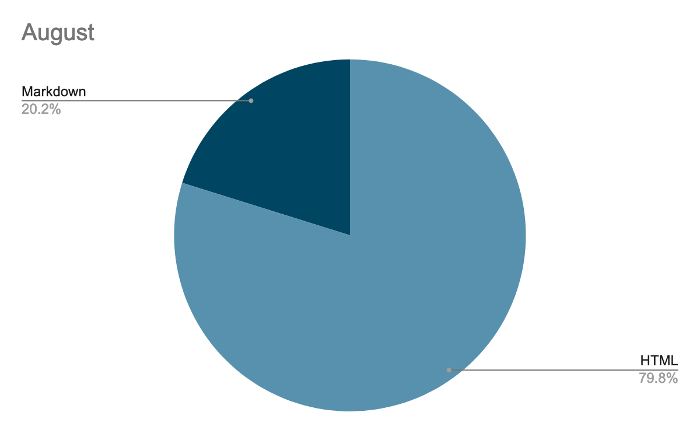
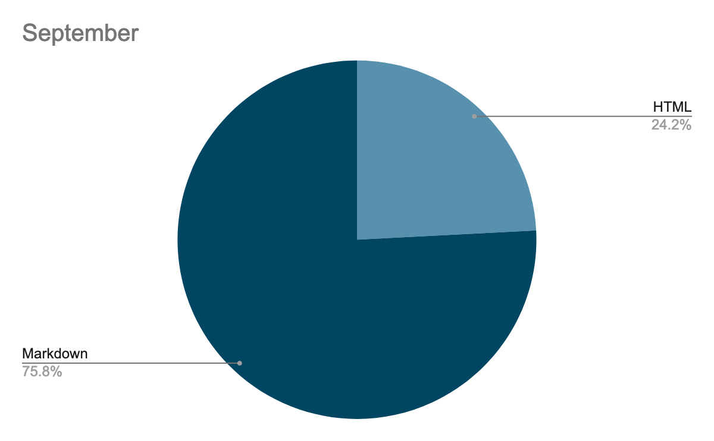

Originally published on October 8, 2021 on:
https://opencollective.com/open-web-docs/updates/open-web-docs-worklog-september-2021-edition

---

# Open Web Docs worklog, September 2021 edition

Welcome to the eighth edition of the OWD worklog. This series reports on our workstream activities and contributions we’re making to open web documentation projects, like MDN Web Docs. Another great month! In this edition, you can find a summary of what we accomplished in September 2021.

### Markdown

This was a big month in the project to convert MDN’s content into Markdown. At the start of the month we had 2,374 pages in Markdown and 9,393 in HTML.

This month we converted:
* Web/API docs
* SVG docs
* HTML docs

We’re now at 9034 pages in Markdown and 2881 in HTML:

We expect to complete this project in October.

### ARIA roles

The ARIA roles received a facelift, with 64 ARIA role pages converted to markdown and completed; including all the document structure, landmark, live region, window, and abstract roles, with a total of 30 new pages. Shout out to [@ericwbailey](https://github.com/ericwbailey) for reviewing the huge PR - [https://github.com/mdn/content/pull/9305](https://github.com/mdn/content/pull/9305). Composite widget roles are currently being written/rewritten.

New pages include: 

* Update of all the **Document structure roles **with 12 new roles: directory, toolbar, tooltip, math, none,  note, presentation, definition, columnheader, rowheader, separator, and group roles
* A update or rewrite of all the **landmark roles**
* Update of all the **live region roles**,with three new pages: log, marquee, and status roles
* Update of all the **window roles**,with one new page: alertdialog
* Addition of all the **abstract roles** for completeness of documentation, with 12 new pages, including: command, composite, input, landmark, range, roletype, section, sectionhead, select, structure, widget and window roles.
* There are also two new **widget roles**: combobox, and radio. Work has started on writing those two and all the others

The ARIA Roles landing page has also been updated, grouping all roles by role type with explanatory text.

### WebXR reference docs

Following up from the work in August, we’ve managed to finish adding reference docs for WebXR APIs. 

In September, we added pages for WebXR Layers:

* [XRLayer](https://opencollective.com/redirect?url=https%3A%2F%2Fdeveloper.mozilla.org%2Fen-US%2Fdocs%2FWeb%2FAPI%2FXRLayer), [XRLayerEvent](https://opencollective.com/redirect?url=https%3A%2F%2Fdeveloper.mozilla.org%2Fen-US%2Fdocs%2FWeb%2FAPI%2FXRLayerEvent)
* [XRCompositionLayer](https://opencollective.com/redirect?url=https%3A%2F%2Fdeveloper.mozilla.org%2Fen-US%2Fdocs%2FWeb%2FAPI%2FXRCompositionLayer), [XRProjectionLayer](https://opencollective.com/redirect?url=https%3A%2F%2Fdeveloper.mozilla.org%2Fen-US%2Fdocs%2FWeb%2FAPI%2FXRProjectionLayer)
* [XRCubeLayer](https://opencollective.com/redirect?url=https%3A%2F%2Fdeveloper.mozilla.org%2Fen-US%2Fdocs%2FWeb%2FAPI%2FXRCubeLayer), [XRCylinderLayer](https://opencollective.com/redirect?url=https%3A%2F%2Fdeveloper.mozilla.org%2Fen-US%2Fdocs%2FWeb%2FAPI%2FXRCylinderLayer), [XREquirectLayer](https://opencollective.com/redirect?url=https%3A%2F%2Fdeveloper.mozilla.org%2Fen-US%2Fdocs%2FWeb%2FAPI%2FXREquirectLayer), [XRQuadLayer](https://opencollective.com/redirect?url=https%3A%2F%2Fdeveloper.mozilla.org%2Fen-US%2Fdocs%2FWeb%2FAPI%2FXRQuadLayer)
* [XRMediaBinding](https://opencollective.com/redirect?url=https%3A%2F%2Fdeveloper.mozilla.org%2Fen-US%2Fdocs%2FWeb%2FAPI%2FXRMediaBinding)

And for WebXR Hand Input:

* [XRHand](https://opencollective.com/redirect?url=https%3A%2F%2Fdeveloper.mozilla.org%2Fen-US%2Fdocs%2FWeb%2FAPI%2FXRHand)

Dominic Cooney (Facebook) is working on providing the compatibility data for these features and for the Oculus browser. See [this BCD issue](https://github.com/mdn/browser-compat-data/issues/12303).

As this project completes, we’ve documented features from 10 WebXR specifications and written 131 new MDN reference pages!

### PR reviews

In September we reviewed 373 pull requests to GitHub repositories in the [https://github.com/mdn](https://github.com/mdn) organization.

### Write The Docs Prague – Writing Day

Write The Docs is a well-established conference about tech writing and its European edition is held in Prague. This year, due to COVID-19, the event is online only.

On October 1st, in collaboration with Daniel Beck (MDN Web Docs, Mozilla) and Lola Odelola (Samsung Internet), Florian and Jean-Yves led a whole day workshop at [Write The Docs Prague](https://opencollective.com/redirect?url=https%3A%2F%2Fwww.writethedocs.org%2Fconf%2Fprague%2F2021%2F). We got up to 28 participants (for an estimated total of about 70 people that day). The participants were introduced to both OWD and MDN Web Docs, and to contribute using Github.

Three tasks were proposed:

* Editorial copy-edition of the HTTP section. The wording in this area has been significantly improved.
* Preparation of the Markdown migration where participants fixed the HTML of the Accessibility section to ease its future migration.
* A brainstorming session by Lola about "Documenting how to Document".

Overall, [63 Pull Requests](https://github.com/mdn/content/pulls?q=+is%3Apr+label%3A%22Event%3A+Write+the+Docs+Prague+2021%22) have been made. This was a great success!

### Q4 projects

The Open Web Docs Steering Committee took part in an open prioritization process. 14 members of the SC handed in their ranked list and we've calculated an overall rank. The results have been published in the [Q4 planning issue](https://github.com/openwebdocs/project/issues/55#issuecomment-937625420). The team will get work started on the top 5 ranked projects:

1. [ARIA attributes](https://github.com/openwebdocs/project/issues/65)
2. [Updating DOM guides (and completing its reference)](https://github.com/openwebdocs/project/issues/50)
3. [Modernizing the Learning Area JavaScript modules](https://github.com/mdn/content/blob/main/rfcs/modernize-learn-js.md)
4. [Documenting events and representing them in BCD](https://github.com/openwebdocs/project/issues/61)
5. [Use webref as the source for CSS formal syntax, instead of mdn/data](https://github.com/openwebdocs/project/issues/44)

### Next month

In October, we’re planning to:

* Finish some projects from Q3 (Markdown conversion, ARIA roles, HTTP docs).
* Get work started on the new Q4 projects.
* Florian will give a talk “Documenting the Web Platform” at [JetBrains JavaScript Day](https://opencollective.com/redirect?url=https%3A%2F%2Fpages.jetbrains.com%2Fjavascript-day-2021%2Fblog).
* Participate in [TPAC breakout sessions](https://opencollective.com/redirect?url=https%3A%2F%2Fwww.w3.org%2Fwiki%2FTPAC%2F2021%2FSessionIdeas).

And this concludes our September update! Until next month, when we return to update you about our October activities, you can reach us at [@OpenWebDocs](https://twitter.com/OpenWebDocs). Want to join us? Visit [https://openwebdocs.org](https://opencollective.com/redirect?url=https%3A%2F%2Fopenwebdocs.org%2F).